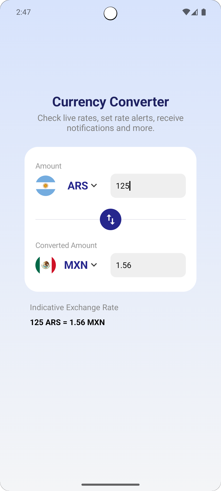

# ConvY 💱 (Kotlin Version)


---

<div align="center">

# 💱 ConvY

### Modern currency converter built with Kotlin + Jetpack Compose


</div>

---

## 📖 About the project

ConvY is an Android application developed using Kotlin and Jetpack Compose to perform real-time currency conversions.

The project was created focusing on modern Android architecture, state management, REST API consumption, and responsive UI development using Material 3.

---

# ✨ Features

- 💱 Real-time currency conversion
- 🌎 Country and currency selection
- ⚡ Fast and modern interface
- 📱 Responsive design
- 🔄 Dynamic value updates
- 🎨 UI fully built with Jetpack Compose

---

# 📱 Preview

<div align="center">



</div>

---

# 🛠️ Technologies Used

## Mobile

- Kotlin
- Jetpack Compose
- Material 3
- ViewModel
- Coroutines
- Retrofit
- State Management
- Navigation Compose

## Architecture

- MVVM
- Clean UI State
- Repository Pattern

---

# 📂 Project Structure

```bash
Currency_Converter_Kotlin
 ┣ 📂 app
 ┃ ┣ 📂 network
 ┃ ┃ ┣ 📂 api
 ┃ ┃ ┣ 📂 client
 ┃ ┃ ┣ 📂 model
 ┃ ┣ 📂 ui
 ┃ ┃ ┣ 📂 components
 ┃ ┃ ┣ 📂 navigation
 ┃ ┃ ┣ 📂 screens
 ┃ ┃ ┣ 📂 theme
 ┃ ┣ 📂 utils
 ┃ ┗ 📂 model
 ┣ 📄 build.gradle.kts
 ┣ 📄 settings.gradle.kts
 ┗ 📄 README.md
```

---

# 💻 Requirements

Before getting started, make sure you have installed:

- Android Studio Hedgehog or newer
- JDK 17+
- Gradle 8+
- Android SDK configured
- Android Emulator or physical device

---

# 🚀 Installing the project

Clone the repository:

```bash
git clone https://github.com/Tuskon/Currency_Converter_Kotlin.git
```

Go to the project folder:

```bash
cd Currency_Converter_Kotlin
```

Open the project in Android Studio.

---

# ☕ Running the application

After opening the project:

1. Wait for Gradle synchronization
2. Start an Android emulator
3. Click on "Run App"

Or use the terminal:

Linux / macOS:

```bash
./gradlew assembleDebug
```

Windows:

```bash
gradlew.bat assembleDebug
```

---

# 🔥 Build APK

To generate the release APK:

```bash
./gradlew assembleRelease
```

The APK will be generated at:

```bash
app/build/outputs/apk/release/
```

---

# 📦 Main Dependencies

```kotlin
implementation("androidx.navigation:navigation-compose:2.8.0")
implementation("com.squareup.retrofit2:retrofit:2.9.0")
implementation("com.squareup.retrofit2:converter-gson:2.9.0")
implementation("androidx.compose material:material-icons-extended")
implementation("io.coil-kt:coil-compose:2.7.0")
```

---

# 🧠 Applied Concepts

- State management
- Reactive UI with Compose
- REST API consumption
- MVVM architecture
- Component-based UI
- Responsiveness
- Modern Android project structure

---

# 👨‍💻 Author

<div align="center">

<a href="https://github.com/Tuskon">
  
</a>

### José Luiz

Software Engineer | Mobile & Automation Specialist 💻

</div>

---

# ⭐ Support the project

If this project helped you, consider giving it a star ⭐

---

# 📝 License

This project is licensed under the MIT License.

Feel free to use.

---